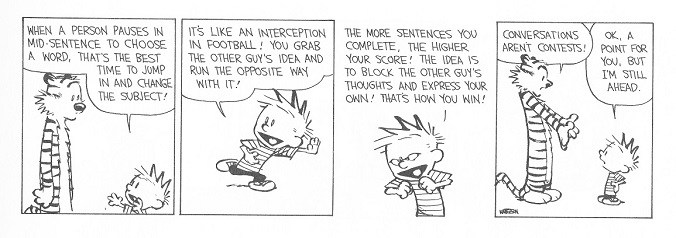

Some people don't know when to shut up. They happily monopolize conversations, paying little attention to the wandering eyes of those in their audience.

These blabbermouths are the extreme sinners, but few of us are perfect. It's not easy to strike the perfect balance between speaking and listening, and even when we do, we're often still more interested in our own thoughts than in those of others. Accordingly, there is a robust thread of social wisdom that says "listen more than you speak", which thankfully prevents most of us from being too obnoxious.

But I think many of us swing too far in the direction of silence, and underappreciate the virtue of speaking our minds.

Okay, it's time to start writing about the semi-epiphany that I had after Borlaug Camp: the virtue of talking more / speaking up. The main point of revelation for me was when playing Avalon, when I was on the good team and I was being too silent. This was a valuable lesson to me. The idea was that bad people find it hard to talk lots because they need to be careful not to reveal their hidden information. And good people need to talk a lot to distinguish themselves from the bad people, and also to help the rest of the group figure things out. This same lesson came from Julia Galef's session on how / why to have unpopular opinions, where she made the point that it's okay to simultaneously hold both an inside view and an outside view, and that it's part of your duty to the epistemic commons to share your inside view. I suppose I could run some sort of simulation if I wanted to demonstrate this idea. But maybe that would be overkill. The main thing right now is to just to figure out: what is my thesis? And what are the ideas that support it? Is this going to be a convergent argument? Or the other kind? (Can't remember the name.) I suppose I should organize it around understanding the convergent premises. But then again, maybe this should just be a sort of reflection on the virtue itself. Maybe that doesn't require any actual argumentation. Anyway, that's the first step: understanding my thesis and the main supporting points, as well as any other ideas I want to convey.

Thesis: sharing your thoughts is an underappreciated virtue.

Premises:

- Silence breeds suspicion.
- Silence is slow.
- Sharing is edifying, especially when you're wrong.
- Sharing helps you decouple your inside view from your omniscient view.
- There is no wisdom in the crowd if everyone is listening for that wisdom but not adding to it.
- You don't have to win to shape the discourse or the outcome.
- Understanding others is important, but it's overvalued as wise advice, especially compared with making your own views as understandable as possible
- It's hard to make your views understandable; you will inevitably reveal inconsistencies the more honestly you play
- Your uncertainty is valuable information

