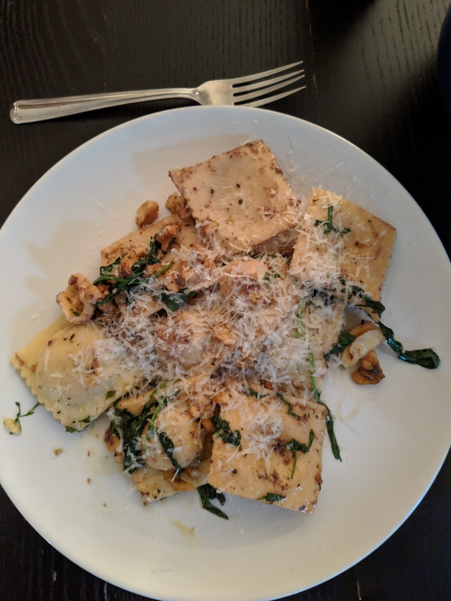

# 1. What went well

**Promotion.** In January I got promoted to a Senior Data Scientist. 

**Newsletter**.

**Twitter.**

**Rock Climbing.**

**Travel.**

**Chess.**

# 2. What could have gone better

**Blog.**

**Reading.**

**Maintaining friendships.**

**Chess.**

# 3. Trajectories for 2020

**Piano.** 🆕 I've played the guitar since I was a kid, but haven't felt as excited about it in the past few years. I've always wanted to learn the piano, so I hope this will be a fun new challenge. By the end of 2020 I would like to be able to learn a random pop song by ear in under an hour.

**Note-taking.** 🆕 After reading Sönke Ahrens' book [How to Take Smart Notes](https://www.goodreads.com/review/show/3085392000), I want to give the slip-box method a test drive. By April 1st I would like to have written 60 literature notes and 30 permanent notes. I'll reassess my trajectory at that point.

**Goal-setting & monthly/quarterly reviews.** ↗️ In the second half of 2019 I got in the swing of doing weekly reviews, but haven't habitually done monthly or quarterly reviews, or completed any significant side projects. In 2020 I would like to do this consistently. To that end, I'll share concrete quarterly goals on my "[/now](https://davidklaing.com/now)" page on April 1st, July 1st, and September 1st, and where relevant I will update any progress trackers every month.

**Blogging.** ↗️ In 2019 I published 7 blog posts, for a total of 6700 words. By the end of 2020 I would like to have published 15,000 words, an average of 1250 every month.

**Reading books.** ↗️ In 2019 I finished six books, and read parts of around 6 more. I estimate that I read about 3500 pages.  Reading isn't a race, but I'm happier the more time I spend reading books, so in 2020 I'm going to shoot for 5000 pages, an average of 400 every month.

**Time with friends**. ↗️ In 2019 I barely ever called my friends, and only spent a few quality weekends with them. In 2020 I'm going reach out to my friends more, and plan more trips and experiences with the ones who live nearby. I'm also going to try to meet more internet friends in person than I did this year (two).

**Local/regional travel & exploration.** ↗️ In 2019 I did a good amount of this—went to Squamish, Nelson, Deep Cove, Salt Spring Island, and Victoria. In 2020 I'd like to do even more, ideally with friends.

**Newsletter.** ➡️

**Twitter.** ➡️

**Rock climbing.** ➡️

**Python skill development.** ➡️

**GTD habits.** ➡️

**Chess.** ↘️

**TV.** ↘️

**Plane travel.** ↘️

# 4. Things that defined my year

## Media

### Books

#### Finished

* Sönke Ahrens, [How to Take Smart Notes](https://www.goodreads.com/review/show/3085392000).
* Larry McMurtry, [Lonesome Dove](goodreads.com/review/show/2818515061).
* Robert Caro, [The Path to Power](https://www.goodreads.com/book/show/86524.The_Path_to_Power).
* N.K. Jemisin, [The Fifth Season](https://www.goodreads.com/book/show/19161852-the-fifth-season).
* Tara Westover, [Educated](https://www.goodreads.com/book/show/37930892-educated).
* James Clear, [Atomic Habits](https://www.goodreads.com/review/show/2674765726).

#### Made a good dent

* William Finnegan, [Barbarian Days](https://www.goodreads.com/review/show/2954913394).
* Ted Chiang, [Exhalation](https://www.goodreads.com/book/show/41160292-exhalation).

#### Abandoned

* Bill Browder, [Red Notice](https://www.goodreads.com/book/show/24811910-red-notice).
* Neil Stephenson, [Snow Crash](https://www.goodreads.com/book/show/40651883-snow-crash).

### Articles

**[One-Touch to Inbox Zero](https://praxis.fortelabs.co/one-touch-to-inbox-zero-a74cfa02e5bf/), by Tiago Forte.** I read this article in July, and it changed the course of my year. It helped me to create better habits around my email inbox, which caused me to start using a task management app, a read-it-later app, and a note-taking app. These systems in turn gave me the confidence to start writing my newsletter, which created other positive feedback loops.

**[Why books don't work](https://andymatuschak.org/books/), by Andy Matuschak.** Reading informational non-fiction is an ineffective way to learn. 

**[Making Knowledge Work Visible](https://praxis.fortelabs.co/making-knowledge-work-visible/), by Tasshin Fogleman.** There is a middle ground between staying completely focused on one project at a time and flitting aimlessly among dozens.

**[Theory of Constraints 101](https://praxis.fortelabs.co/theory-of-constraints-101-2d4d9cf1916a/), by Tiago Forte.** To increase the throughput of a system, you need to increase the throughput at its tightest bottleneck.

**[Deep Laziness](https://www.ribbonfarm.com/2018/04/06/deep-laziness/), by Sarah Perry.** Find activities and behaviors that resonate with the core of your being, then elaborate on them to create still deeper resonance.

**[always bet on text](https://graydon2.dreamwidth.org/193447.html), by graydon2.** It's fine to focus your creative energy on text rather than other forms of media.

**[The Tyranny of Ideas](https://nadiaeghbal.com/ideas), by Nadia Eghbal.** What if people don't have ideas, but ideas have people?

**[Status as a Service](https://www.eugenewei.com/blog/2019/2/19/status-as-a-service), by Eugene Wei.** Social media companies make money off ads, but what they provide to users is an efficient means of acquiring social status.

**[Going Critical](https://meltingasphalt.com/going-critical/), by Kevin Simler.** An intuition pump for how networks thrive or die.

### Videos

**[A Very Vulfy Christmas](https://www.youtube.com/watch?v=Czj01VhbEwM), by Woody Goss.**

### Music

#### Top 5 Albums

**1. The Beths, [Future Me Hates Me](https://open.spotify.com/album/4xG41eVnTuDK6uMmcksQ9B?si=ls2r_tFuStGIPwrZZJtKRg) (2018).**

**2. Vampire Weekend, [Father of the Bride](https://open.spotify.com/album/1A3nVEWRJ8yvlPzawHI1pQ?si=KWK34ZUiTFWuc53OkWGMxg) (2019).**

**3. Theo Katzman & Four Fine Gentlemen, [My Heart is Live in Berlin](https://open.spotify.com/album/3ZG1uBVhfvxpmYWn4GBOP8?si=6ljRllomR1CZ8M6PGLTi-g) (2019).**

**4. Ariana Grande, [thank u, next](https://open.spotify.com/album/2fYhqwDWXjbpjaIJPEfKFw?si=fSCEgIWARP2mCUhhO3lrvg) (2019).**

**5. Emily King, [Scenery](https://open.spotify.com/album/5Q1QrtmEGrT0UqGlaMPzpf?si=JhG4kYqySUCZi1H1BsXi-w) (2019).**

#### Notable EPs

**Madison Cunningham, [For the Sake of the Rhyme](https://open.spotify.com/album/4BaN7uc9vzyOberlO92BRR?si=4HkiawlzQ-Ggt3IYkc8muQ) (2019)**.

**Theo Katzman, [Modern Johnny Tackles the Issues](https://open.spotify.com/album/7gojr5zlht1MRS27cZoCvH?si=EQG3MepAS6Cvav6-3TtqUA) (2019) & [Modern Johnny Wallows in Introspection and Gently Goes Mad](https://open.spotify.com/album/6qkrvSl5fHAHizjL4t4kY9?si=J8vEUYgERCanTRZFi3MD_g) (2019).**

#### Songs

Here they are in a [Spotify playlist](https://open.spotify.com/playlist/1zPthmG8ws3m95Hgu8k7dl?si=0JiZb3_gSwOrgth452_eWA).

1. [Future Me Hates Me](https://open.spotify.com/track/0hY72avNehvdV7YVBEH4oo?si=9nzTUJtuS4a9d8dalF3zaA), by The Beths
2. [Want Me Back](https://open.spotify.com/track/64zfaCPwuuPkEtoNt1jzFx?si=RGp4zfkyQJeQx4RPK4KhFQ), by Cody Fry, Cory Wong, & Dynamo
3. [(I Don't Want to Be A) Billionaire](https://open.spotify.com/track/3zSqVXRt2uc8Wi8S9ivzSj?si=JuYPrtBSQq-ljEEaJ5eDwg), by Theo Katzman
4. [Better](https://open.spotify.com/track/1QFFUmFYKXNYhq2Akjh7HR?si=UM3DpwwgQx2i_NJvt6MaVA), by Cody Fry, Cory Wong, & Dynamo
5. [Deep](https://open.spotify.com/track/1LzmZWMpiPqeEIvaYCzO3Z?si=jvADXB8MQS23NJuUW5Z7ww), by Julia Michaels
6. [boyfriend](https://open.spotify.com/track/0Ryd8975WihbObpp5cPW1t?si=SOkTSfl8RcOUyInyvq3yMQ), by Ariana Grande & Social House
7. [Look At Me Now - Acoustic](https://open.spotify.com/track/62bvQkxanPXjNmiH20qhLh?si=67dFbptuSZu0kmbA_zyJXw), by Emily King
8. [This Life](https://open.spotify.com/track/4dRqYKhLVujxiBXcq50YzG?si=hjbrYCj3SXShiE4qZyaVyA), by Vampire Weekend
9. [Cosmic Sans](https://open.spotify.com/track/594a2gJwaid7KGIn9QhYJL?si=azeoWPlkQTeBJjaPqqXYxA), by Cory Wong & Tom Misch
10. [All At Once](https://open.spotify.com/track/59x97Muk1DvBUhyX8xcxJo?si=U3nTg32PRn62m2fOgN24IA), by Madison Cunningham
11. [Make It Better (feat. Smokey Robinson)](https://open.spotify.com/track/4SBVWkRIMJ6WBCYPvr5Bwr?si=BRlwL6SUQF2MHgpXsobL8g), by Anderson .Paak
12. [The Death of Us](https://open.spotify.com/track/4QBBnpnChhX6RDbfnjklyI?si=TQJNH35GR5C1E0o4p9yMLQ), by Theo Katzman
13. [Casualty](https://open.spotify.com/track/1RLNZ2VOHkclcOu0WC4Yo1?si=FY8A_1GxTKuXHMglXu_M4Q), by Lawrence
14. [The Feels](https://open.spotify.com/track/74mGikI3P484sQAFSnjNuV?si=hNStdvMKSH-glOf_9J2z4w), by Maren Morris
15. [Never Really Over](https://open.spotify.com/track/5PYQUBXc7NYeI1obMKSJK0?si=ZDo7v8XrTMu9gMjONGTWUw), by Katy Perry
16. [Next To You](https://open.spotify.com/track/35NKhHKLlTAW21TH6S4Us6?si=pnb05XU6RomZTFNk29AHow), by Dirty Loops
17. [Northsiders](https://open.spotify.com/track/34g8vWL65ZOAvDWCdq8kP3?si=Eesm60y0Q9yE7u0c8hP_mw), by Christian Lee Hutson
18. [I Forgot That You Existed](https://open.spotify.com/track/43rA71bccXFGD4C8GOpIlN?si=_eS_j0UqRfCVEINJLx8e_A), by Taylor Swift
19. [Juice](https://open.spotify.com/track/0k664IuFwVP557Gnx7RhIl?si=C8RzIlbjT5GYamT6GoP5sA), by Lizzo
20. [Want You In My Room](https://open.spotify.com/track/2wDL38wQrMzed4yNyXa8q2?si=rSnPLcEdTeuGYhq8GTYADg), by Carly Rae Jepsen

#### Concerts & Shows

**[Scary Pockets](https://www.youtube.com/channel/UC-2JUs_G21BrJ0efehwGkUw) in Los Angeles.**

**[Anderson .Paak](https://open.spotify.com/artist/3jK9MiCrA42lLAdMGUZpwa?si=WY9kL82VQKKgzaZ3kAthBw) in Vancouver.**

**[Jacob Collier](https://open.spotify.com/artist/0QWrMNukfcVOmgEU0FEDyD?si=hsMQ6wk2SxCLB8iIBY5MHg) in Vancouver.**

**[Vulfpeck](https://open.spotify.com/artist/7pXu47GoqSYRajmBCjxdD6?si=cAz677YPSLyI6R7ogAsjZA) at Madison Square Gardens** ([seen on YouTube](https://www.youtube.com/watch?v=rv4wf7bzfFE)).

**[Come From Away](https://en.wikipedia.org/wiki/Come_from_Away) in Toronto.**

**[Cats](https://en.wikipedia.org/wiki/Cats_(musical)) in Toronto.**

****

### TV/film

**[Toy Story 4](https://en.wikipedia.org/wiki/Toy_Story_4)**. Best film of the year for me. Made me laugh harder than I have in years.

**[The Lighthouse](https://en.wikipedia.org/wiki/The_Lighthouse_(2019_film))**. As disturbing as it looks, but surprisingly funny too, and entertaining throughout.

**[Marriage Story](https://en.wikipedia.org/wiki/Marriage_Story_(2019_film))**. Incredible writing and acting. I hope I never have to watch it again.

**[Westworld, Season 1](https://en.wikipedia.org/wiki/Westworld_(season_1))**. Twisty and thought-provoking.

**[Broadchurch, Season 1](https://en.wikipedia.org/wiki/Broadchurch_(series_1))**. A moving mystery set in Scotland.

## Products & Services

**[Roam](https://roamresearch.com/).**

**[Amazing Marvin](https://amazingmarvin.com/).**

**[Instapaper](https://www.instapaper.com/).**

**[The Browser](https://thebrowser.com/).**

**[Python Morsels](https://www.pythonmorsels.com/).**

**[Gum soft-picks](https://www.amazon.ca/Sunstar-6504R-Soft-Picks-Advanced-Pack/dp/B07B91ZNT5).**

**[Mug warmer](https://www.amazon.ca/Salton-SMW12-Mug-Warmer-White/dp/B0095GOBGE).**

**[Programmable Kettle](https://www.amazon.ca/gp/product/B003WEAHUY).**

## People

**Tiago Forte.**

## Concepts

**Second brain / Zettlekasten.**

**Antilibrary.**

## Recipes

**[Spring green minestrone](https://www.occasionallyeggs.com/spring-green-minestrone/).**

**[Carrot, red lentil, and spinach soup](https://www.occasionallyeggs.com/carrot-red-lentil-spinach-soup/)**.

**Fresh pasta.** It's way easier than you'd think, and so delicious! Mix some semolina flour with water, knead it for a while, and shape it however you like. Here's a butternut squash ravioli (first try!):

